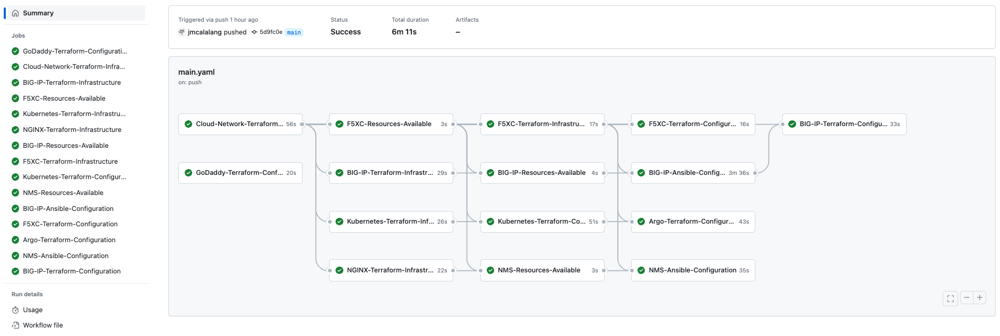

# Jon's C.R.U.D (Create, Read, Update, and Delete.)

Congratulations you've made it to Jon's lab. This lab environment is used daily to demonstrate various F5 products (F5XC, BIG-IP, and NGINX).

All the components of this lab are maintained through GitOps (Argo) and CI with GitHub Actions (Terraform and Ansible). The components are loosely coupled, meaning there is no carryover from one GitHub Action to another, or between Terraform and Ansible. This was done on purpose to be able to consume/copy just the needed components.

[](https://github.com/jmcalalang/lab/actions/workflows/main.yaml)

## Video Overview

<a href="http://www.youtube.com/watch?feature=player_embedded&v=azYSNIG_jhc" target="_blank">
 
</a>

## Configuration vs Infrastructure

My belief is these code-managed resources should be split. This aligns nicely with day 0-1, and day 2+ operation concepts. As the two resources are used, they are loosely coupled, you may have an infrastructure with different configurations or vice versa. Each product will have a breakdown of the tool used Terraform/Ansible, and then within that folder what the tool is managing configuration or infrastructure.

Terraform state is setup as remote, with app.terraform.io (Terraform Cloud).

## Environment

Environment variables are passed from GitHub repository secrets to actions, keeping secrets out of code.

To set environment variables:

``` export EXAMPLE="example" ```

Common environment diagram (changes slightly for demos):


## Folder Structure

### github

GitHub Actions for the lab environment

- GitHub Actions pipeline



- GitHub Actions breakdown
  - Argo
    - Terraform
  - BIG-IP
    - Terraform
    - Ansible
  - F5XC
    - Terraform
  - GoDaddy
    - Terraform
  - Kubernetes
    - Terraform
  - NGINX / NGINX Management System
    - Terraform
    - Ansible

### big-ip

Configuration and Infrastructure management of BIG-IP resources

- Ansible (Configuration)
  - Access Profile Import (Video: https://youtu.be/fRd2B186fcM )
  - AS3 Common Declaration (Video: https://youtu.be/rrjrcnwAe1g)
  - Access Profile JWT Validation (Video: https://youtu.be/fRd2B186fcM)
  - Automation Toolchain Installation
  - Create Partitions
  - Provision BIG-IP Modules
  - System BIG-IP Settings (Video: https://youtu.be/6bOH_AMO1MA)
  - Telemetry Streaming Declaration

| **Configuration Env Variables** |
|---------------------------------|
| BIGIP_AKS_PASSWORD              |
| BIGIP_AKS_USER                  |
| BIGIP_HOSTNAME                  |
| BIGIP_PASSWORD                  |
| BIGIP_USER                      |
| OTEL_HOST                       |
| OTEL_TOKEN                      |

- Terraform (Configuration)
  - AS3 Application Declarations
  - FAST Application Declarations (Video: https://youtu.be/eSQDWH4B16g)
  - Application Services in Common
  - AS3 Forward Proxy (Video: https://youtu.be/m73nQPv0zas)

| **Configuration Env Variables** |
|---------------------------------|
| AD_SERVICE_LDAP_PASSWORD        |
| AZURE_SUBSCRIPTION              |
| BIGIP_HOSTNAME                  |
| BIGIP_PASSWORD                  |
| BIGIP_USER                      |

- Terraform (Azure Infrastructure)
  - BIG-IP(s)
  - Managed Service Identity Roles(s)
  - Resource Group
  - Availability Set

| **Infrastructure Env Variables** |
|----------------------------------|
| AZURE_APPID                      |
| AZURE_PASSWORD                   |
| AZURE_SUBSCRIPTION               |
| AZURE_TENANT                     |
| BIGIP_PASSWORD                   |
| BIGIP_USER                       |

- Terraform (AWS Infrastructure)
  - BIG-IP(s)
  - Identity and Access Management Roles(s)
  - Security Groups (External / Management)
  - Elastic IP
  - Route53 Records

| **Infrastructure Env Variables** |
|----------------------------------|
| AWS_ACCESS_KEY_ID                |
| AWS_SECRET_ACCESS_KEY            |

### certs

Certs for F5XC Authentication

- Generated p12 file

### distributed-cloud

Configuration and Infrastructure management of F5XC resources

- Terraform (Configuration)
  - F5XC Application Firewall
  - F5XC Customer Edge (Video: https://youtu.be/CMatJNVGTsw)
  - F5XC Certificate / Key (Video: https://youtu.be/QEDl1drj-BI)
  - F5XC Endpoints
  - F5XC Health Checks
  - F5XC Http Application Load-Balancers
  - F5XC Http Discovery Load-Balancer
  - F5XC Http JWT API Security Load-Balancer (Video: https://youtu.be/M171ohxK7YY)
  - F5XC Kubernetes
  - F5XC Origin Pools
  - F5XC Routes
  - F5XC Terraform Provider Testing (Video: https://youtu.be/vuGQlzzcpOY)

| **Configuration Env Variables** |
|---------------------------------|
| CALALANG_NET_CERT               |
| CALALANG_NET_KEY                |
| VES_P12_PASSWORD                |

- Terraform (Infrastructure)
  - F5XC vk8s Site
  - F5XC Azure Site (Video: https://youtu.be/CMatJNVGTsw)
  - F5XC Azure AppStack

| **Infrastructure Env Variables** |
|----------------------------------|
| F5XC_CLOUD_CREDENTIAL            |
| VES_P12_PASSWORD                 |

### godaddy

Configuration management of GoDaddy resources

| **Configuration Env Variables** |
|---------------------------------|
| GODADDY_API_KEY                 |
| GODADDY_API_SECRET              |

- Terraform
  - Records Management

### kubernetes

Configuration management of Kubernetes resources

- Terraform (Configuration)
  - NGINX Ingress Controller in Azure Kubernetes Service
  - NGINX IngressLink Controller in Azure Kubernetes Service
  - F5XC Kubernetes Site in Azure Kubernetes Service
  - Argo in Azure Kubernetes Service (Video: https://youtu.be/34jva7uPngg)
  - BIG-IP Container Ingress Services in Azure Kubernetes Service
  - NGINX Unprivileged in F5XC vk8s

| **Configuration Env Variables** |
|---------------------------------|
| AZURE_APPID                     |
| AZURE_PASSWORD                  |
| AZURE_SUBSCRIPTION              |
| AZURE_TENANT                    |
| BIGIP_AKS_PASSWORD              |
| BIGIP_AKS_USER                  |
| F5XC_SITE_TOKEN                 |
| NGINX_REPO_JWT                  |
| VES_VK8S_CLIENT_CERTIFICATE     |
| VES_VK8S_CLIENT_KEY             |
| VES_VK8S_CLUSTER_CA_CERTIFICATE |
| VES_VK8S_CONTEXT                |
| VES_VK8S_SERVER                 |

- Terraform (Infrastructure)
  - Azure Kubernetes Service(s)
  - Azure Container Registry(s)
  - Managed Service Identity Roles(s)
  - Resource Group

| **Infrastructure Env Variables** |
|----------------------------------|
| AZURE_APPID                      |
| AZURE_PASSWORD                   |
| AZURE_SUBSCRIPTION               |
| AZURE_TENANT                     |

### networking

Infrastructure management of AWS and Azure networks

- Terraform (AWS Infrastructure)
  - AWS VPC
  - AWS VPC DHCP Options
  - AWS Subnets (2 Availability zones)
  - AWS Security Groups
  - AWS Route Table
  - AWS NAT Gateway
  - AWS Internet Gateway

| **Infrastructure Env Variables** |
|----------------------------------|
| AWS_ACCESS_KEY_ID                |
| AWS_SECRET_ACCESS_KEY            |

- Terraform (Azure Infrastructure)
  - Azure Resource Group
  - Azure VNET
  - Azure Subnets
  - Azure Security Groups
  - Azure Route Table
  - Azure NAT Gateway

| **Infrastructure Env Variables** |
|----------------------------------|
| AZURE_APPID                      |
| AZURE_PASSWORD                   |
| AZURE_SUBSCRIPTION               |
| AZURE_TENANT                     |

### nginx

Configuration and Infrastructure management of NGINX resources

- Ansible (Configuration)
  - NGINX Management Suite Configuration of NGINX

| **Configuration Env Variables** |
|---------------------------------|
| NMS_HOSTNAME                    |
| NMS_INSTANCE_GROUP              |
| NMS_PASSWORD                    |
| NMS_TOKEN                       |
| NMS_USER                        |

- Terraform (Infrastructure)
  - NGINX(s)
  - Availability Set
  - Resource Group

| **Infrastructure Env Variables** |
|----------------------------------|
| AZURE_APPID                      |
| AZURE_PASSWORD                   |
| AZURE_SUBSCRIPTION               |
| AZURE_TENANT                     |
| NGINX_PASSWORD                   |
| NGINX_USER                       |

### services

Configuration of Kubernetes services

- argo
- ingresslink.calalang.net
- kubernetes.calalang.net
- NGINX Management Suite
- nms.calalang.net
- syslog
- transport.calalang.net
