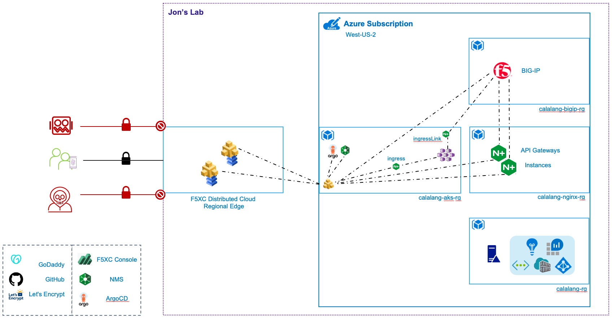

# F5 Lab

Congratulations you've made it to Jon's F5 lab. This lab environment is used daily to demonstrate various F5 products (F5XC, BIG-IP, and NGINX).

All the components of this lab are maintained through GitOps (Argo) and CI with GitHub Actions.

|                                                           **Products**                                                          |                                                           **Tools**                                                          |                                                                                      **Code**                                                                                     |
|:-------------------------------------------------------------------------------------------------------------------------------:|:----------------------------------------------------------------------------------------------------------------------------:|:---------------------------------------------------------------------------------------------------------------------------------------------------------------------------------:|
|                                          |                  |  |
|                                 |                           |             |
|  |  |       |
|                  |                                 |                                                                                                                                                                                   |
|                           |                                                                                                                              |                                                                                                                                                                                   |

## Environment

## Folder Structure

### github

GitHub Actions for Ansible and Terraform

- GitHub Actions
  - F5XC
    - Terraform
  - BIG-IP
    - Terraform
    - Ansible
  - GoDaddy
    - Terraform
  - NGINX / NGINX Management System
    - Terraform
    - Ansible
  - Kubernetes
    - Terraform
  - Argo
    - Terraform

### big-ip

Configuration and Infrastructure management of BIG-IP resources

- Ansible (Configuration)
  - Access Profile Import
  - AS3 Common Declaration
  - Automation Toolchain Installation
  - Create Partitions
  - Provision BIG-IP Modules
  - System BIG-IP Settings
  - Telemetry Streaming Declaration

- Terraform (Configuration)
  - AS3 Application Declarations
  - FAST Application Declarations
  - Application Services in Common

- Terraform (Infrastructure)
  - Create BIG-IP(s)
  - Create Availability Set
  - Create RBAC Roles
  - Create Resource Group

### certs

Certs for F5XC Authentication

- Generated p12 file

### distributed-cloud

Configuration management of F5XC resources

- Terraform (Infrastructure)
  - F5XC Application Firewall
  - F5XC Origin Pools
  - F5XC Health Checks
  - F5XC Http Load-Balancers

### godaddy

Configuration management of GoDaddy resources

- Terraform
  - Records Management

### kubernetes

Configuration management of Kubernetes resources

- Terraform (Configuration)
  - Install NGINX Ingress Controller
  - Install NGINX IngressLink Controller
  - Install F5XC Kubernetes Site
  - Install Argo

- Terraform (Infrastructure)
  - Create Azure Kubernetes Service
  - Create Azure Container Regisitry
  - Create RBAC Roles
  - Create Resource Group

### nginx

Configuration and Infrastructure management of NGINX resources

- Ansible (Configuration)
  - NGINX Management Suite Configuration of NGINX

- Terraform (Infrastructure)
  - Create NGINX(s)
  - Create Availability Set
  - Create Resource Group

### services

Configuration of Kubernetes services

- Argo
- Container Ingress Services (BIG-IP)
- Google Online Boutique
- ingresslink.calalang.net
- kubernetes.calalang.net
- NGINX Management Suite
- NGINX.org
- NGINX Plus
- nms.calalang.net
- Syslog